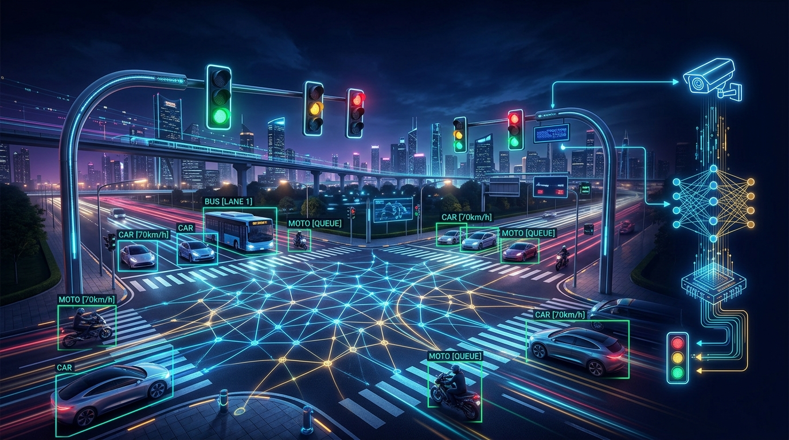
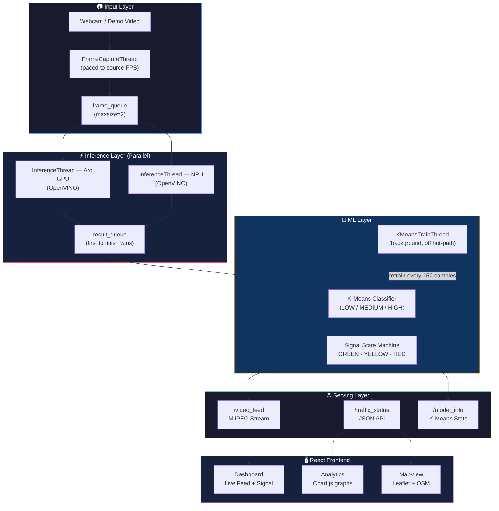
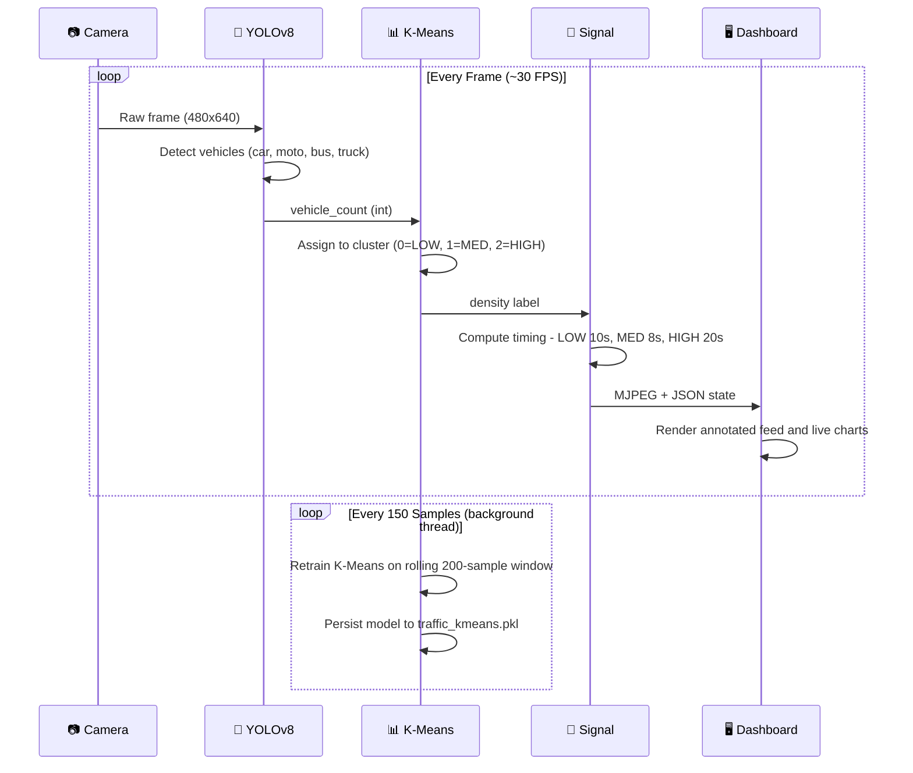
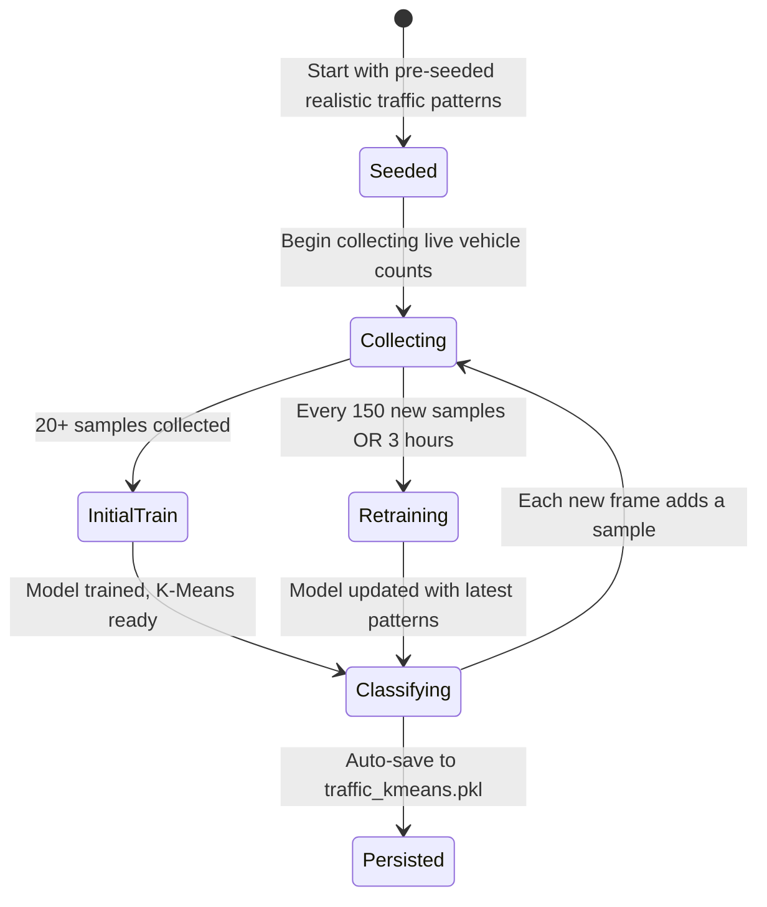
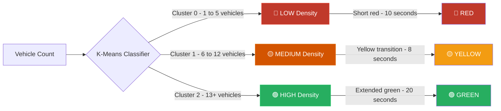
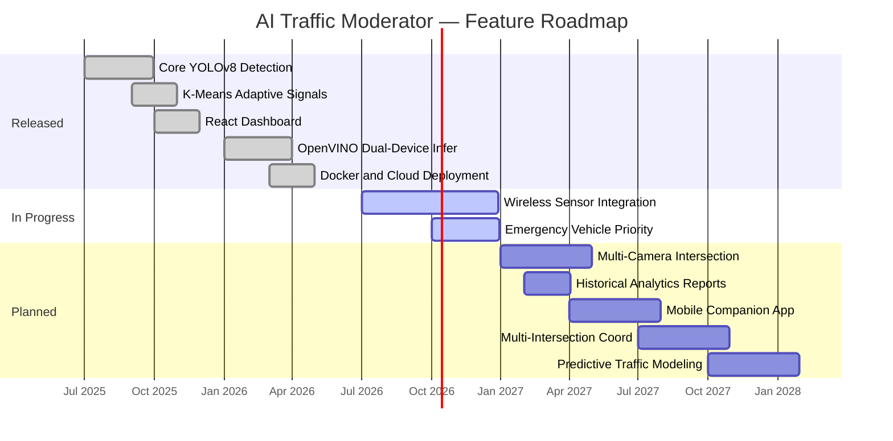
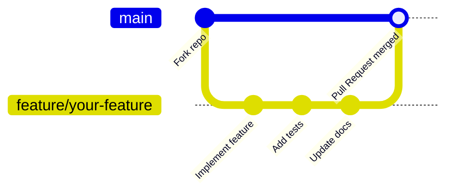

<div align="center">



<br/><br/>

# 🚦 AI Traffic Moderator

### *Where Computer Vision meets Smart City Infrastructure*

**Intelligent, real-time traffic signal control powered by YOLOv8 · K-Means Clustering · OpenVINO · React**

<br/>

[](https://www.python.org/)
[](https://react.dev/)
[](https://flask.palletsprojects.com/)
[](https://github.com/ultralytics/ultralytics)
[](https://docs.openvino.ai/)
[](https://www.docker.com/)

<br/>

[](https://github.com/Manaswin05/AI-Traffic-Moderator/stargazers)
[](https://github.com/Manaswin05/AI-Traffic-Moderator/network/members)
[](https://github.com/Manaswin05/AI-Traffic-Moderator/issues)
[](#license)
[](https://github.com/Manaswin05/AI-Traffic-Moderator)

<br/>

[🚀 **Live Demo**](https://huggingface.co/spaces/Manaswin2005/ai-traffic-moderator) · [📖 **Docs**](Docs/INDEX.md) · [🐛 **Report Bug**](https://github.com/Manaswin05/AI-Traffic-Moderator/issues) · [💡 **Feature Request**](https://github.com/Manaswin05/AI-Traffic-Moderator/issues) · [💖 **Sponsor**](#-sponsorship--support)

</div>

---

## 📖 Overview

**AI Traffic Moderator** replaces static, timer-based traffic lights with a fully adaptive, AI-driven system. It captures a live video feed, detects every vehicle in real time using **YOLOv8 + OpenVINO** (running simultaneously on GPU *and* NPU), classifies traffic density with a self-learning **K-Means** model, and dynamically adjusts signal timing — all visualized through a stunning **React 18** dashboard.

> **"Stop guessing. Start learning."** — traditional signals burn green time even when roads are empty. This system listens, learns, and responds.

### What makes it special?

| Capability | Details |
|:---|:---|
| 🎯 **Dual-Chip Inference** | Runs YOLOv8 concurrently on Intel Arc GPU **and** NPU via OpenVINO — whichever finishes first wins |
| 🤖 **Self-Learning AI** | K-Means model trains itself from live data; no manual threshold tuning ever |
| 📡 **Parallel Pipeline** | 4-thread architecture: Capture → Inference (GPU+NPU) → Training → MJPEG Streaming |
| 🗺️ **Full-Stack Dashboard** | React 18 with live video, Chart.js analytics, Leaflet map, animated traffic signal |
| ☁️ **Cloud-Native** | One-command Docker deploy to Render or Hugging Face Spaces |
| 💾 **512 MB Friendly** | Entire ML pipeline fits in Render free tier with ~1.6 KB K-Means data footprint |

---

## 🏗️ System Architecture



---

## 🧠 AI Pipeline — Sequence Diagram



---

## 🔄 K-Means Learning Lifecycle



---

## 🎯 Signal Decision Logic



---

## ✨ Features

| Feature | Description |
|:---|:---|
| 🎯 **Real-time Vehicle Detection** | YOLOv8 nano OpenVINO model detects cars, motorcycles, buses, trucks with bounding box overlays |
| ⚡ **Dual-Device Inference** | GPU + NPU run simultaneously; first result consumed — maximizes throughput |
| 🤖 **Self-Learning K-Means** | Unsupervised model trains from live observations; zero static thresholds |
| 🚦 **Adaptive Signal Control** | GREEN/YELLOW/RED timing adjusts automatically per AI-classified density |
| 📊 **Live Analytics** | Chart.js graphs tracking vehicle counts and density classification over time |
| 🗺️ **Interactive Map** | Leaflet + OpenStreetMap camera location visualization |
| 📹 **MJPEG Video Stream** | Low-latency annotated feed served directly to the browser |
| 🔄 **Source Switching** | Toggle between webcam and demo video on the fly |
| 🐳 **Docker Ready** | Single-command containerized deployment |
| 💾 **Micro Footprint** | ~1.6 KB rolling data window; runs on 512 MB free-tier hosting |

---

## 🛠️ Tech Stack

<table>
<tr>
<th>Frontend</th>
<th>Backend</th>
<th>AI / ML</th>
<th>DevOps</th>
</tr>
<tr>
<td>

- React 18
- Vite 5
- React Router 6
- Chart.js / react-chartjs-2
- React Leaflet
- Axios
- Lenis (smooth scroll)
- Three.js

</td>
<td>

- Flask 3.0
- Flask-CORS
- Gunicorn
- OpenCV (headless)

</td>
<td>

- YOLOv8 (Ultralytics)
- OpenVINO Runtime
- PyTorch (CPU fallback)
- scikit-learn (K-Means)
- NumPy

</td>
<td>

- Docker
- Render
- Hugging Face Spaces
- Concurrently (dev)

</td>
</tr>
</table>

---

## 📋 Prerequisites

| Requirement | Version |
|:---|:---|
| Python | 3.8+ |
| Node.js | 16+ |
| npm | 8+ |
| Git | Any recent |
| Webcam | Optional — demo video included |

---

## 🚀 Getting Started

### 1 · Clone

```bash
git clone https://github.com/Manaswin05/AI-Traffic-Moderator.git
cd AI-Traffic-Moderator
```

### 2 · Install dependencies

```bash
# Python dependencies
pip install -r requirements.txt

# Node.js dependencies
npm install
```

### 3 · Run

```bash
npm run dev
```

| Service | URL |
|:---|:---|
| Frontend (Vite) | `http://localhost:3000` |
| Backend (Flask) | `http://localhost:5000` |

> **Note:** Use any username/password on the login screen — authentication is in demo mode.


---

## 🎛️ Usage — Video / Webcam Toggle

Once the app is running, open `http://localhost:3000` and go to the **Dashboard** tab. You'll see the **Live Camera Feed** panel at the top-left. In its header bar there is a sliding toggle switch:

```
┌─────────────────────────────────────────────────────────┐
│ 📷  Live Camera Feed   [ VIDEO | WEBCAM ]   ● CAM-01    │
│                         ▲ click to switch               │
│                                                         │
│   ┌─────────────────────────────────────────────────┐   │
│   │           Annotated video stream                │   │
│   │   [car]        [truck]      [motorcycle]        │   │
│   │   Signal: GREEN  Vehicles: 14  AI: HIGH         │   │
│   └─────────────────────────────────────────────────┘   │
└─────────────────────────────────────────────────────────┘
```

| Mode | What happens |
|:---|:---|
| **VIDEO** *(default)* | Streams `demo_traffic.mp4` — works everywhere including cloud |
| **WEBCAM** | Switches to your physical webcam (index 0→1→2 auto-detected) |

**How to switch:**

1. Click the `[ VIDEO \| WEBCAM ]` toggle in the camera panel header
2. The slider pill animates to the selected side
3. The backend calls `POST /set_video_source` and hot-swaps the capture source
4. The **System Logs** panel on the right confirms: `Video source switched to webcam`

> **Note:** Webcam switching works **locally only**. On Render / Hugging Face Spaces, no physical camera is available — the toggle gracefully falls back and logs `Failed to switch to webcam`.

---

## 🐳 Docker Deployment


```bash
# Build production frontend
npm run build

# Build and run the Docker image
docker build -t ai-traffic-moderator .
docker run -p 7860:7860 ai-traffic-moderator
```

Visit `http://localhost:7860`. For cloud guides:
- [Render Deployment →](Docs/RENDER_DEPLOYMENT.md)
- [Hugging Face Spaces →](Docs/HF_DOCKER_DEPLOYMENT.md)

---

## 📁 Project Structure

```
AI-Traffic-Moderator/
├── src/                            # React frontend source
│   ├── components/
│   │   ├── Sidebar.jsx             # Navigation sidebar
│   │   └── Topbar.jsx              # Top navigation bar
│   ├── pages/
│   │   ├── Dashboard.jsx/.css      # Main dashboard + live feed
│   │   ├── Analytics.jsx/.css      # Real-time analytics charts
│   │   └── MapView.jsx/.css        # Interactive map view
│   ├── App.jsx                     # Root component & routing
│   └── index.css                   # Global styles
├── models/
│   ├── yolov8n_openvino_model/     # OpenVINO exported YOLOv8 nano
│   └── traffic_kmeans.pkl          # Persisted K-Means (auto-generated)
├── Docs/                           # Extended documentation
├── assets/                         # README assets (banner, screenshots)
├── app.py                          # Flask backend & AI pipeline (4-thread)
├── Dockerfile                      # Container configuration
├── render.yaml                     # Render deployment manifest
├── requirements.txt                # Python dependencies
├── package.json                    # Node.js dependencies & scripts
└── demo_traffic.mp4                # Bundled demo video
```

---

## 🔌 API Reference

| Endpoint | Method | Description |
|:---|:---|:---|
| `/video_feed` | `GET` | MJPEG annotated video stream |
| `/traffic_status` | `GET` | Current signal, vehicle count, density, cluster |
| `/model_info` | `GET` | Detailed K-Means model statistics |
| `/train_model` | `POST` | Manually trigger K-Means retraining |
| `/set_video_source` | `POST` | Switch between `webcam` and `video` |

**Example — `GET /traffic_status`:**

```json
{
  "traffic_light": "green",
  "vehicle_count": 14,
  "traffic_density": "HIGH",
  "cluster": 2,
  "model_trained": true,
  "samples_collected": 185,
  "cluster_centers": [3.2, 9.8, 19.5]
}
```

---

## ⚙️ Configuration

### Backend (`app.py`)

```python
VIDEO_SOURCE     = os.environ.get("VIDEO_SOURCE", "demo_traffic.mp4")
VEHICLE_CLASSES  = {2: 'car', 3: 'motorcycle', 5: 'bus', 7: 'truck'}
MIN_SAMPLES      = 20     # Minimum data before first K-Means training
RETRAIN_INTERVAL = 150    # Samples between retraining cycles
MAX_DATA_SIZE    = 200    # Rolling window size
```

### Frontend (`vite.config.js`)

```javascript
server: {
  port: 3000,
  proxy: {
    '/video_feed':       'http://localhost:5000',
    '/traffic_status':   'http://localhost:5000',
    '/set_video_source': 'http://localhost:5000'
  }
}
```

---

## 🐛 Troubleshooting

<details>
<summary><b>PyTorch model loading error</b></summary>

If you see `_pickle.UnpicklingError` with PyTorch >= 2.6, a monkey-patch already sets `weights_only=False`. No action needed.

</details>

<details>
<summary><b>Camera not detected</b></summary>

- Ensure no other app is using the webcam.
- Check camera permissions in OS settings.
- Set `VIDEO_SOURCE` env variable to a different camera index.
- Cloud deployments automatically fall back to `demo_traffic.mp4`.

</details>

<details>
<summary><b>Port already in use</b></summary>

- **Frontend:** Change `server.port` in `vite.config.js`.
- **Backend:** Change `app.run(port=5001)` in `app.py`.

</details>

<details>
<summary><b>High memory usage on free-tier hosting</b></summary>

K-Means uses a bounded `deque` of 200 samples (~1.6 KB) and CPU-only PyTorch fallback. See [MEMORY_COMPARISON.md](Docs/MEMORY_COMPARISON.md).

</details>

<details>
<summary><b>OpenVINO GPU/NPU not detected</b></summary>

The pipeline gracefully falls back to CPU PyTorch. Check `[+] YOLO worker ready on ...` in console logs to see which device is active.

</details>

---

## 🗺️ Roadmap



---

## 🤝 Contributing

Contributions are **very welcome**!



**Steps:**

1. **Fork** the repository
2. **Create** a feature branch — `git checkout -b feature/your-feature`
3. **Commit** your changes — `git commit -m "feat: describe your change"`
4. **Push** to the branch — `git push origin feature/your-feature`
5. **Open** a Pull Request

---

## 💖 Sponsorship & Support

> This project is free and open-source, built with love by a solo developer. If it saved you time or powers your research — consider supporting its development!

**Why sponsor?**
- 🚀 Priority feature requests
- 🐛 Faster bug-fix turnaround
- 📖 Detailed implementation walkthroughs
- 🙌 Support open-source smart-city AI research

[](https://github.com/sponsors/Manaswin05)
[](https://buymeacoffee.com/manaswin05)

---

## ⭐ Star History

[](https://star-history.com/#Manaswin05/AI-Traffic-Moderator&Date)

---

## 📚 Documentation

| Document | Description |
|:---|:---|
| [INDEX.md](Docs/INDEX.md) | Documentation index and navigation |
| [KMEANS_README.md](Docs/KMEANS_README.md) | K-Means classification deep-dive |
| [KMEANS_SUMMARY.md](Docs/KMEANS_SUMMARY.md) | K-Means implementation summary |
| [RENDER_DEPLOYMENT.md](Docs/RENDER_DEPLOYMENT.md) | Render deployment guide |
| [HF_DOCKER_DEPLOYMENT.md](Docs/HF_DOCKER_DEPLOYMENT.md) | Hugging Face Spaces deployment |
| [MEMORY_COMPARISON.md](Docs/MEMORY_COMPARISON.md) | Memory optimization analysis |
| [YOLO_MODEL_FAQ.md](Docs/YOLO_MODEL_FAQ.md) | YOLOv8 model FAQ |
| [VISUAL_COMPARISON.md](Docs/VISUAL_COMPARISON.md) | Visual before/after comparison |
| [TESTING_KMEANS.md](Docs/TESTING_KMEANS.md) | K-Means testing guide |

---

## 🙏 Acknowledgments

- [Ultralytics YOLOv8](https://github.com/ultralytics/ultralytics) — Real-time object detection
- [Intel OpenVINO](https://docs.openvino.ai/) — Hardware-accelerated inference
- [OpenCV](https://opencv.org/) — Computer vision and video processing
- [scikit-learn](https://scikit-learn.org/) — K-Means clustering
- [React](https://react.dev/) — Frontend UI framework
- [Flask](https://flask.palletsprojects.com/) — Lightweight Python backend
- [Chart.js](https://www.chartjs.org/) — Data visualization
- [Leaflet](https://leafletjs.com/) — Interactive maps

---

## 📝 License

This project is intended for **educational and research purposes**. Feel free to use, modify, and build on it — attribution appreciated!

---

## 👤 Lead Author

**Manaswin Sripatnala**

[](https://github.com/Manaswin05)
[](https://huggingface.co/spaces/Manaswin2005/ai-traffic-moderator)

---

## 🤝 Co-Authors

| | Contributor | GitHub |
|:---:|:---|:---|
| 👩‍💻 | **Poorva** | [](https://github.com/poorva234) |
| 👩‍💻 | **Tanushka Chavan** | [](https://github.com/Tanushka-Chavan) |
| 👩‍💻 | **Niel Mandhare** | [](https://github.com/nielmandhare) |

> Built together with passion for smart cities and open-source AI. 🇮🇳

---

<div align="center">

### 🚦 *Making cities smarter, one intersection at a time.*

<br/>

⭐ **Star this repo** &nbsp;·&nbsp; 🍴 **Fork and contribute** &nbsp;·&nbsp; 💖 **Sponsor the project**

<br/>

Made with ❤️ in India 🇮🇳

</div>
